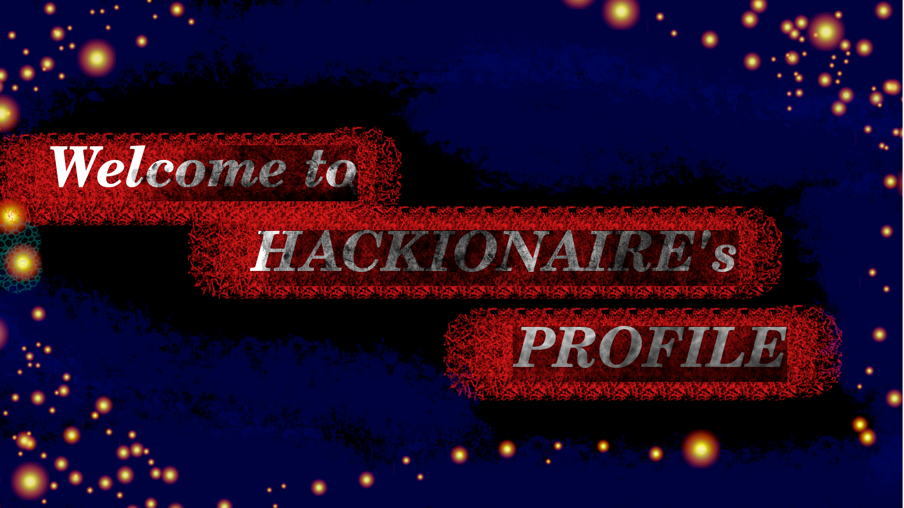

  # Official hackathon profile
- 👋 Hi, I’m **Aakash A Nair**, this is my official Hackathon GitHub Account. 🔱
- 👀 I’m interested in learning new technology, solving math problems, solvig mysteries, lookout for a new problem 
- 💻 I am interested in **Hackathons, Competitive coding, Animation, Graphic Designing**
- My favorite Programming languages are C, C++, Java, Python, Go
- Fav Tech 💻 *Artificial Intelligence, Machine Learning, Data Science, Deep Learning, Internet of Things, Cyber Security, Cloud Computing, Robotics, App Deveopment, Quantum Computing*
- Current Working Technologies - Artificial Intelligence, Machine Learning, Data Science, Deep Learning
- 🌱 I’m currently learning Machine Learning, Deep Learning, BlockChain
- 💞️ I’m looking to collaborate on a problem that has great impact to the real world.
- 📫 How to reach me 

<!---
hacknarog/hacknarog is a ✨ special ✨ repository because its `README.md` (this file) appears on your GitHub profile.
You can click the Preview link to take a look at your changes.
--->
